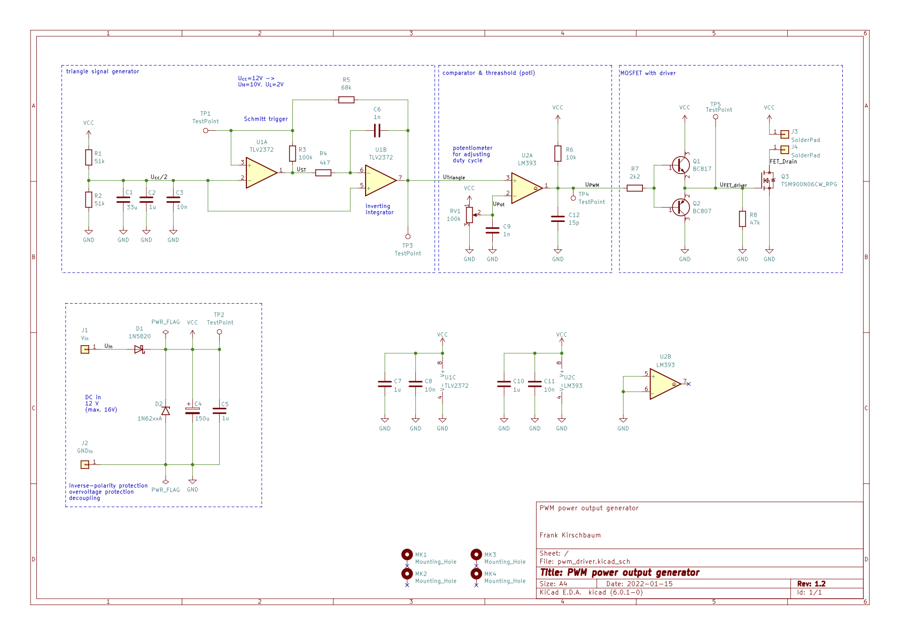
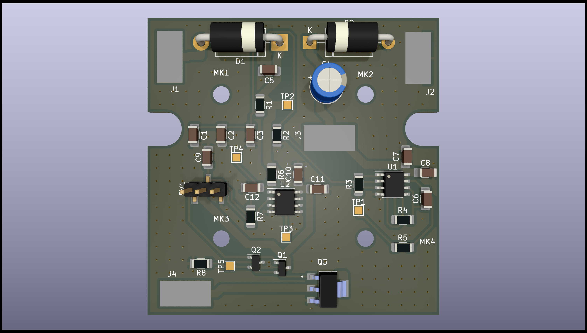

# PWM power output generator

PWM power output generator for utilization in training arangements.

Generates a 0 to 100% duty cycle to the load at the output. The dyty cycle can be controlled by an potentiometer. Operating voltage 12VDC. Max. current 3A. In addition it features Inverse supply voltage protection and over-voltage protection. The board fits into a Hammond 1593K enclosure.

Most of PWM generator designs are based on a 555 IC. But I haven't found one that covers up the full range of duty cycle from 0 to 100%. Thus I used a more basic design.

